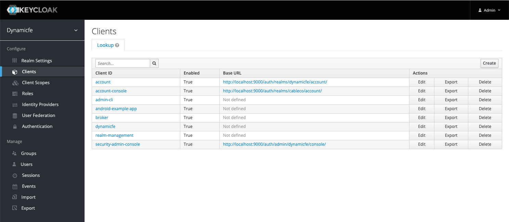
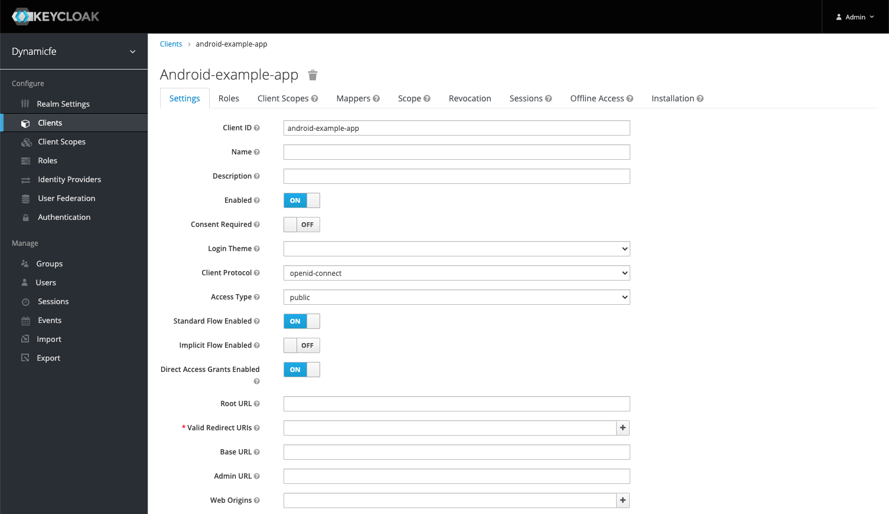
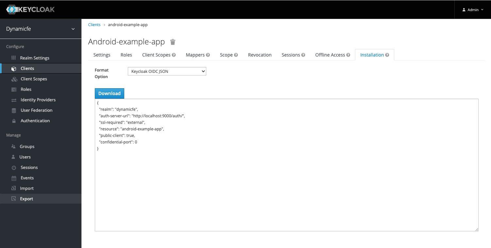

# Keycloak/OpenId Login Android Example

This is an android application that demonstrates how to authenticate with Keycloak using the [OpenAuth Library for Android](https://github.com/openid/AppAuth-Android).

## Configuring Keycloak

### Client

When you log into a Keycloak realm from Android, you will need to configure a **"client"** for that realm that represents your application. A Keycloak client is where all the rules are set for how your application is to connect to Keycloak and perform authentication:

In this example, we create a client called: "android-example-app" and we set the following settings that are important:

* **Client Protocol: open-id connect**
* **Access Type public**

These settings should actually be the default.

#### The Authentication Callback

Using the OpenAuth Library, we need to specify a callback url that our Android App can use to pick up the auth data from a sucessful authentication. This is explained in detail in the [OpenAuth Docs here](https://github.com/openid/AppAuth-Android#capturing-the-authorization-redirect).

**It is important to note that in order for the callback to work, it must be specified in Keycloak as a "Valid Redirect URI".**

If you are calling back to a url, add it like so:

`https://example.app/*`

If you are calling back to a scheme(like this example app does), add it like so:

`appauth://*`

### OpenAuth Arguments

Once you have your client configured, you are going to need to get the variables needed for OpenAuth to connect to Keycloak. If you navigate to the Installation tab of your client, you will see a dropdown of format options. Any of the options will display these variables to you:

#### Fetch Config URL

If you decide to fetch the open-id config from Keycloak, the format of the url for any realm is:

`{authServerUrl}/realms/{realm}/.well-known/openid-configuration"`

